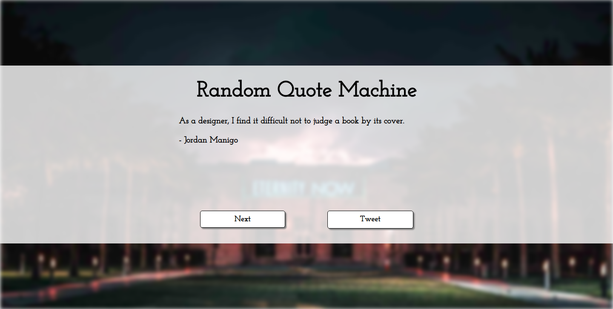

# Random Quote Machine

## Introduction
Read random quotes from [Quotes on Design](https://quotesondesign.com) and tweet one if you liked it!

This project is part of freeCodeCamps Frontend Libraries certificate.

***

## Project Requirements
* There is a wrapper element with a corresponding id="quote-box".
* Within #quote-box is an element with a corresponding id="text".
* Within #quote-box is an element with a corresponding id="author".
* Within #quote-box is a clickable element with a corresponding id="new-quote".
* Within #quote-box is a clickable element with a corresponding id="tweet-quote".
* On first load, the quote machine displays a random quote in the element with id="text".
* On first load, the quote machine displays the random quote's author in the element with id="author".
* When the #new-quote button is clicked, the quote machine should fetch a new quote and display it in the #text element.
* The quote machine should fetch the new quote's author when the #new-quote button is clicked and display it in the #author element.
* It is possible to tweet the current quote by clicking on the #tweet-quote a element. This a element should include the "twitter.com/intent/tweet" path in it's href attribute to tweet the current quote.
* The #quote-box wrapper element should be horizontally centered. Please run tests with browser's zoom level at 100% and page maximized.

***

## Project Data
Quotes on Design:  
https://quotesondesign.com

***

## Final Project
https://myrmidonut.github.io/fcc_frontend_random_quote_machine

***

## Preview Images
### Main Screen:

